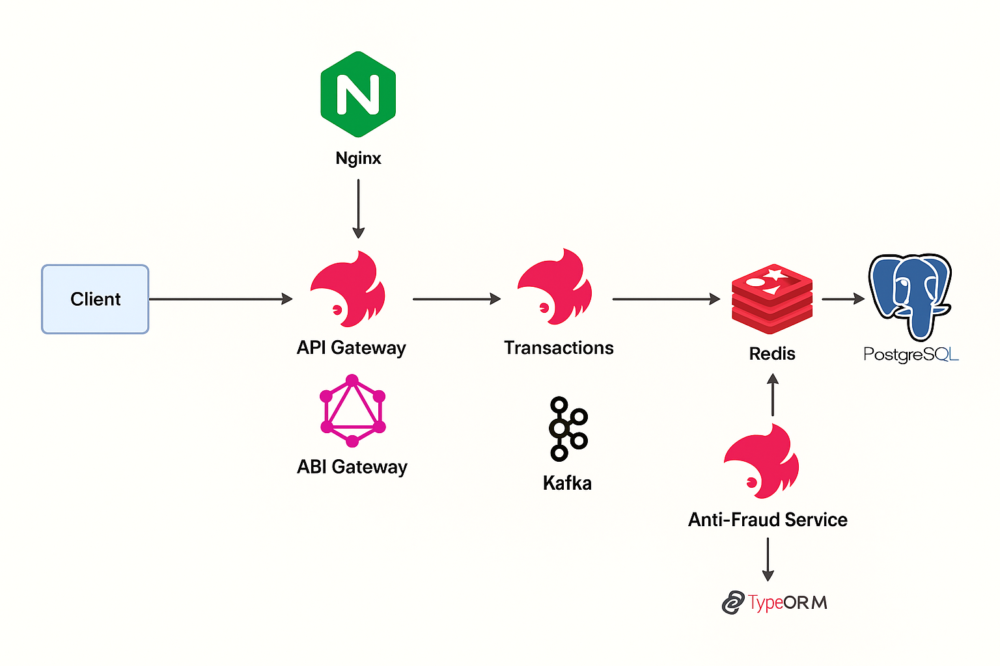

# Transaction & Anti-Fraud Microservices Architecture
<p align="center">
  
</p>

## 🚀 How to Use

Follow these steps to run the project locally using Docker and Kafka:

### 1. Clone the repository

```bash
git clone https://github.com/fredsalv01/nginx-nest-kafka-microservices.git
cd nginx-nest-kafka-microservices
```

### 2. Start Kafka, Zookeeper, PostgreSQL, and Redis with Docker Compose

```bash
docker-compose up -d
```

This will start the necessary infrastructure including:
- Kafka & Zookeeper
- PostgreSQL
- Redis

### 3. Start the services

Each service runs in its own folder (e.g. `api-gateway`, `transaction-service`, `antifraud-service`). Open a terminal in each folder and run:

```bash
# For example, in api-gateway/
npm install
npm run start:dev
```

Repeat the steps above for:
- `transaction-service`
- `antifraud-service`

### 4. Create a transaction using the API Gateway

Send a GraphQL mutation to create a transaction. Example using a tool like Postman or Insomnia:

```graphql
mutation {
  createTransaction(input: {
    accountExternalIdDebit: "uuid-debit",
    accountExternalIdCredit: "uuid-credit",
    tranferTypeId: 1,
    value: 1200
  }) {
    id
    status
    value
  }
}
```

### 5. Observe Kafka Event Flow

- `api-gateway` will emit a `transaction.initiate` event
- `transaction-service` will store the transaction and emit `transaction.created`
- `antifraud-service` will evaluate and emit `transaction.status.update`
- `transaction-service` will update the transaction status in the database

### ✅ Result

Query the database (or implement a GraphQL query later) to verify that the status has been updated to `approved` or `rejected` based on the antifraud evaluation.

## Diagram Explanation

### Client → API Gateway → Transaction-Service
- **Step 1:** Client sends a `createTransaction` request (e.g. via GraphQL) to the API Gateway.
- **Step 2:** API Gateway:
  - Receives the GraphQL mutation.
  - Validates input.
  - Publishes an event named `transaction.initiate` on Kafka.
- **Step 3:** Transaction-Service:
  - Consumes the `transaction.initiate` event.
  - Creates a new transaction record in the database with:
    - `status` = **`pending`**
  - Emits a `transaction.created` event with the saved transaction details.
---

## Transaction-Service → Saves Pending Transaction → PostgreSQL
- **Step 1:** Upon consuming the `transaction.initiate` message, Transaction-Service persists a new row in the `transactions` table.  
- **Step 2:** This row has the following fields:
  - `id` (UUID)  
  - `accountExternalIdDebit` (Guid)  
  - `accountExternalIdCredit` (Guid)  
  - `tranferTypeId` (integer)  
  - `value` (numeric)  
  - `status` (enum: `pending` | `approved` | `rejected`, defaults to **`pending`**)  
  - `createdAt` (timestamp)  

---

## Transaction-Service → `transaction.created` → Anti-Fraud-Service
- **Step 1:** Once the **`pending`** transaction is saved, Transaction-Service emits `transaction.created`, including the newly created transaction’s details (ID, debit/credit accounts, transfer type, value, status, timestamp).  
- **Step 2:** The **Anti-Fraud-Service** subscribes to the `transaction.created` topic and receives that event in real time.  

---

## Anti-Fraud-Service Evaluates → Emits Status Event
- **Step 1:** Upon receiving a `transaction.created` event, Anti-Fraud-Service runs its fraud-detection logic (for example: if `value < 1000` → **approved**, else **rejected**).  
- **Step 2:** Depending on the result, Anti-Fraud-Service emits one of two events on Kafka:
  - `transaction.status.update` with payload  
    ```json
    { 
      "id": "<transactionId>", 
      "status": "approved" 
    }
    ```
  - `transaction.status.update` with payload  
    ```json
    { 
      "id": "<transactionId>", 
      "status": "rejected" 
    }
    ```

---

## Anti-Fraud → Transaction-Service → Update Database
- Transaction-Service also subscribes to the `transaction.status.update` topic.  
- When it consumes a status update (either **approved** or **rejected**), it updates the corresponding `transactions` row in PostgreSQL by changing the `status` column from **`pending`** to either **`approved`** or **`rejected`**.  

## Notes
- **Pending Status**
  - All newly created transactions start with `status = pending`.
  - The anti-fraud step determines whether to approve or reject that transaction.
- **Durable, Decoupled Messaging**
  - By using Kafka topics (`transaction.initiate`, `transaction.created`, `transaction.status.update`), each microservice can scale independently and process messages at its own pace.
  - Messages are persisted in Kafka, ensuring that no event is lost if a consumer restarts.
- **Database (PostgreSQL)**
  - The `transactions` table holds every transaction record.
  - TypeORM (or any ORM) can be used to define the entity, synchronize the schema, and run CRUD/update operations.
- **Anti-Fraud Logic**
  - In a production environment, fraud logic might involve more advanced rules, machine learning models, or external API calls.
  - In this basic example, a simple value-based rule is used (approved if `value < 1000`, otherwise rejected).

---

## File Structure Example

```text
/api-gateway
│
├── src/
│   ├── transaction/
│   │   ├── dto/
│   │   │   └── create-transaction.input.ts
│   │   ├── models/
│   │   │   └── transaction.model.ts
│   │   └── transaction.resolver.ts
│   └── kafka/
│       └── kafka.producer.ts
│
├── Dockerfile
└── package.json

/transaction-service
│
├── src/
│   ├── transaction/
│   │   ├── dto/
│   │   │   └── create-transaction.input.ts
│   │   ├── entities/
│   │   │   └── transaction.entity.ts
│   │   ├── enums/
│   │   │   └── transaction-status.enum.ts
│   │   ├── transaction.service.ts
│   │   ├── transaction.consumer.ts
│   │   └── status.consumer.ts
│   ├── kafka/
│   │   └── kafka.producer.ts
│   ├── app.module.ts
│   └── main.ts
│
├── Dockerfile
└── package.json

/anti-fraud-service
│
├── src/
│   ├── antifraud.service.ts
│   ├── transaction.consumer.ts
│   ├── app.module.ts
│   └── main.ts
│
├── Dockerfile
└── package.json

/nginx
└── nginx.conf

docker-compose.yml  
README.md  
```
